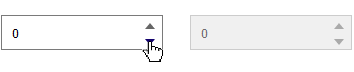

# angulario-number-input

[](https://greenkeeper.io/)

[](https://travis-ci.org/Dyskovsky/angulario-number-input)
[](https://david-dm.org/dyskovsky/angulario-number-input)
[](https://david-dm.org/dyskovsky/angulario-number-input?type=dev)
[](https://github.com/dyskovsky/angulario-number-input)
[](https://github.com/dyskovsky/angulario-number-input)


> Material styled number input for Angular



Online example https://dyskovsky.github.io/angulario-number-input

## Install

``npm install angulario-number-input --save``


## Usage
```javascript
import { DksNumberInputModule } from 'angulario-number-input';

@NgModule({
  imports: [ DksNumberInputModule ],
  ...
})
```

```html
<dks-number-input>
  <input type="number"/>    
</dks-number-input>
```

## Custom theming example
```css
.dks-arrow {
  color: red;
  border-width: 4px;
  margin-right: 10px;
}

.dks-arrow:hover {
  color: blue;
}

.dks-arrow.disabled {
  color: gray;
}
```